# Consultant Backend - Architecture Diagrams

This document contains comprehensive Mermaid diagrams for the Scala-based consultant backend system.

## 1. Project Structure - Subprojects Overview

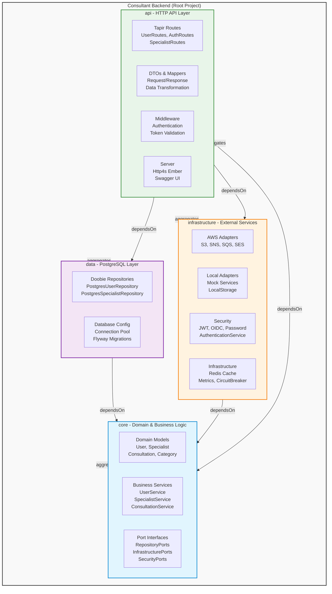

---

## 2. Hexagonal Architecture Overview

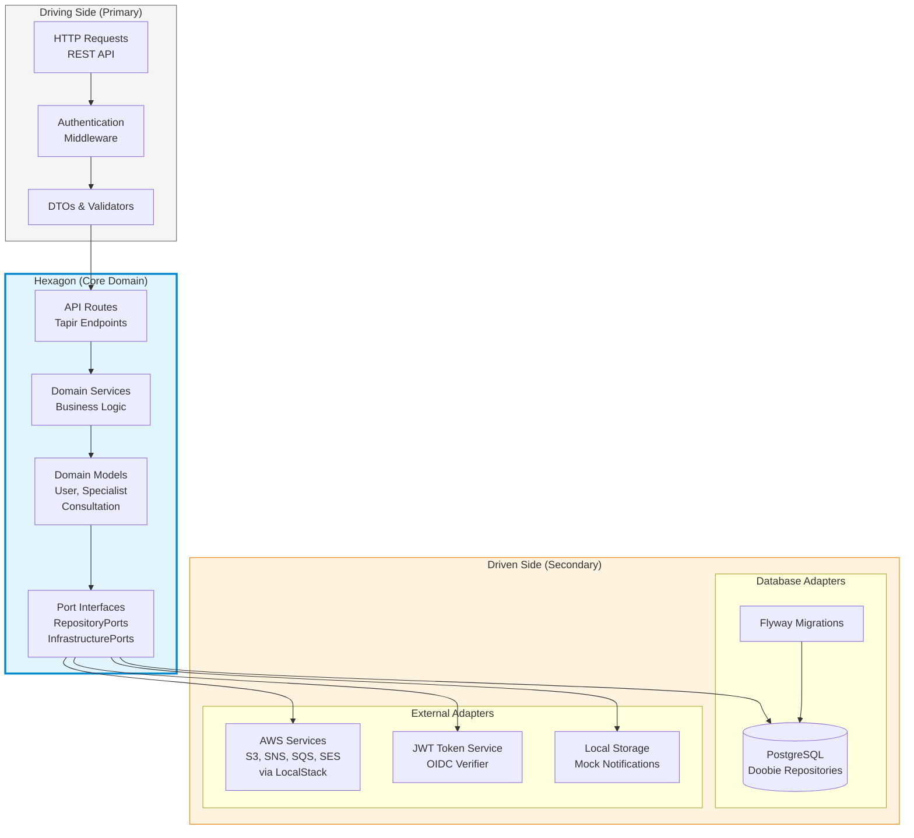

---

## 3. Sequence Diagram - User Authentication Flow

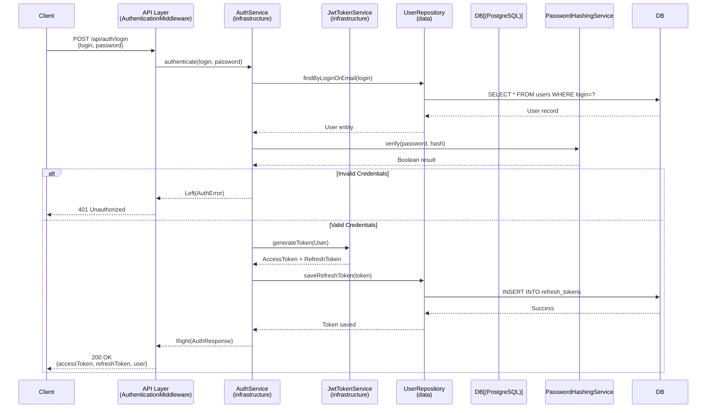

---

## 4. Sequence Diagram - Search Specialists

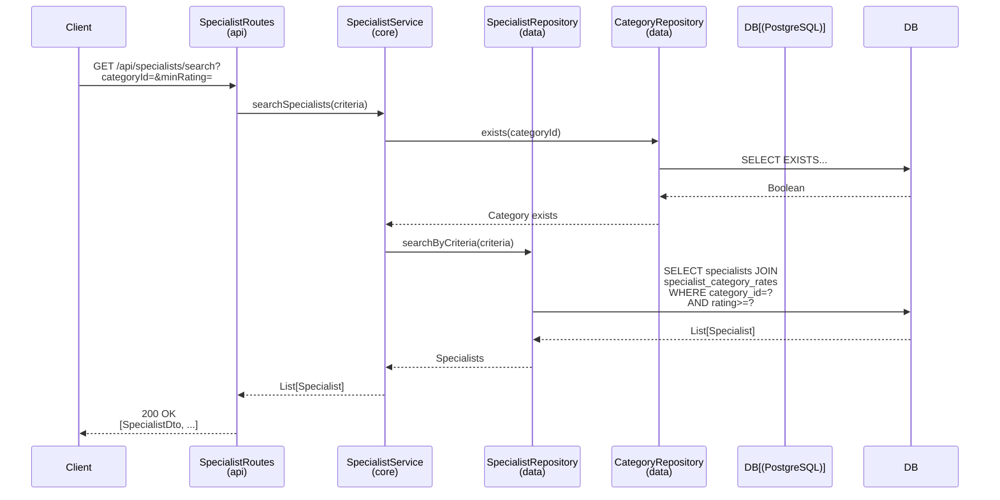

---

## 5. Sequence Diagram - Create Consultation

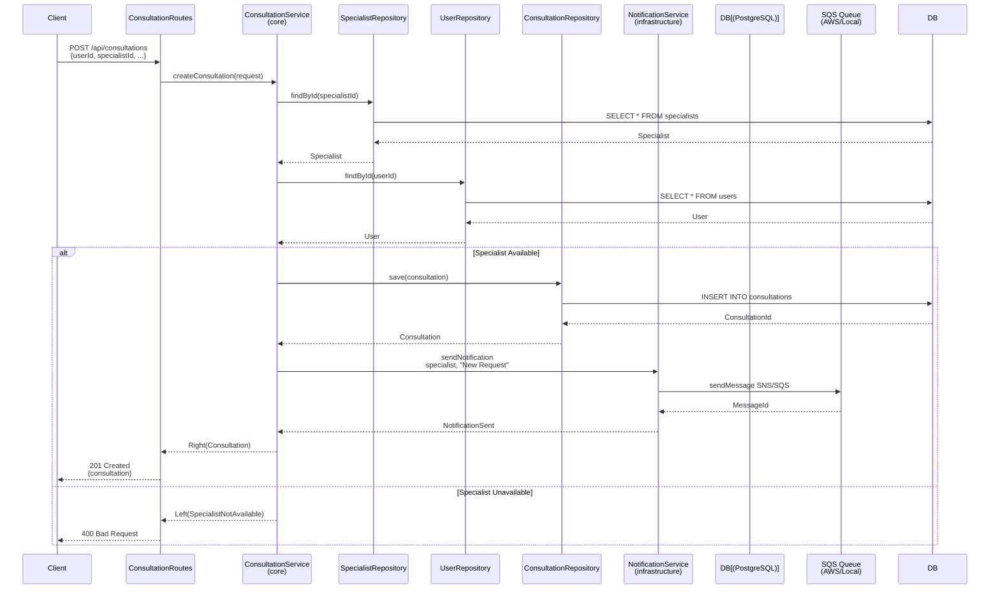

---

## 6. Class Diagram - Domain Models

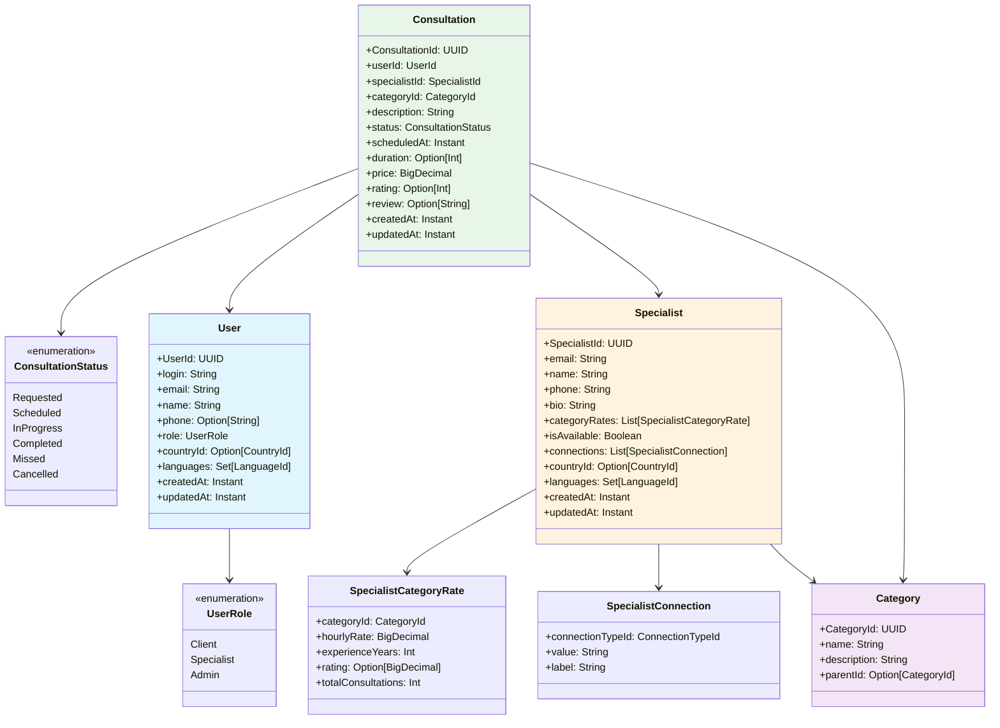

---

## 7. Class Diagram - Service Layer

```mermaid
classDiagram
    class UserService {
        +create(request): Either[DomainError, User]
        +findById(id): Either[DomainError, User]
        +update(id, updates): Either[DomainError, User]
        +list(offset, limit): Either[DomainError, List[User]]
    }
    
    class SpecialistService {
        +create(request): Either[DomainError, Specialist]
        +findById(id): Either[DomainError, Specialist]
        +search(criteria): Either[DomainError, List[Specialist]]
        +updateAvailability(id, available): Either[DomainError, Specialist]
    }
    
    class ConsultationService {
        +create(request): Either[DomainError, Consultation]
        +findById(id): Either[DomainError, Consultation]
        +findByUser(userId): Either[DomainError, List[Consultation]]
        +findBySpecialist(specId): Either[DomainError, List[Consultation]]
        +updateStatus(id, status): Either[DomainError, Consultation]
        +addReview(id, rating, review): Either[DomainError, Consultation]
    }
    
    class CategoryService {
        +create(request): Either[DomainError, Category]
        +findById(id): Either[DomainError, Category]
        +listAll(): Either[DomainError, List[Category]]
        +listHierarchy(): Either[DomainError, CategoryTree]
    }
    
    class UserRepository {
        <<interface>>
        +save(user): F[Unit]
        +findById(id): F[Option[User]]
        +findByLogin(login): F[Option[User]]
        +findAll(offset, limit): F[List[User]]
    }
    
    class SpecialistRepository {
        <<interface>>
        +save(specialist): F[Unit]
        +findById(id): F[Option[Specialist]]
        +searchByCriteria(criteria): F[List[Specialist]]
    }
    
    class ConsultationRepository {
        <<interface>>
        +save(consultation): F[Unit]
        +findById(id): F[Option[Consultation]]
        +findByUser(userId): F[List[Consultation]]
        +findBySpecialist(specId): F[List[Consultation]]
    }
    
    class CategoryRepository {
        <<interface>>
        +save(category): F[Unit]
        +findById(id): F[Option[Category]]
        +findAll(): F[List[Category]]
    }
    
    UserService ..> UserRepository
    SpecialistService ..> SpecialistRepository
    ConsultationService ..> ConsultationRepository
    CategoryService ..> CategoryRepository
    
    style UserService fill:#e8f5e9
    style SpecialistService fill:#fff3e0
    style ConsultationService fill:#e1f5fe
    style CategoryService fill:#f3e5f5
```

---

## 8. Class Diagram - Ports & Adapters

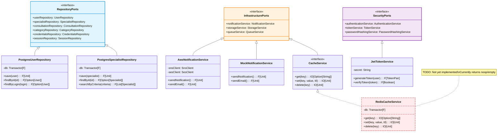

---

## 9. Entity Relationship Diagram (Database Schema)

```mermaid
erDiagram
    USERS ||--o{ CONSULTATIONS : creates
    USERS ||--|| CREDENTIALS : has
    USERS ||--o{ SESSIONS : has
    USERS ||--o{ SECURITY_AUDIT : generates
    
    SPECIALISTS ||--o{ CONSULTATIONS : provides
    SPECIALISTS ||--o{ SPECIALIST_CATEGORIES : categorized_in
    SPECIALISTS ||--o{ SPECIALIST_CATEGORY_RATES : has_rates
    SPECIALISTS ||--o{ SPECIALIST_CONNECTIONS : has
    SPECIALISTS ||--o{ AVAILABILITY_SLOTS : defines
    
    CATEGORIES ||--o{ SPECIALIST_CATEGORIES : contains
    CATEGORIES ||--o{ SPECIALIST_CATEGORY_RATES : priced_in
    CATEGORIES ||--o{ CONSULTATIONS : consulted_in
    CATEGORIES ||--o{ CATEGORIES : parent_child
    
    CONSULTATIONS ||--|| CONSULTATION_REVIEWS : reviewed_as
    
    CONNECTION_TYPES ||--o{ SPECIALIST_CONNECTIONS : used_by
    
    NOTIFICATION_PREFERENCES ||--|| USERS : belongs_to
    
    REFRESH_TOKENS ||--|| CREDENTIALS : associated_with
    
    USERS {
        UUID id PK
        String login UK
        String email UK
        String name
        String phone
        UserRole role
        UUID country_id FK
        Timestamp created_at
        Timestamp updated_at
    }
    
    CREDENTIALS {
        UUID id PK
        UUID user_id UK FK
        String password_hash
        Timestamp created_at
        Timestamp updated_at
    }
    
    SPECIALISTS {
        UUID id PK
        String email UK
        String name
        String phone
        String bio
        Boolean is_available
        UUID country_id FK
        Timestamp created_at
        Timestamp updated_at
    }
    
    SPECIALIST_CATEGORY_RATES {
        UUID specialist_id PK FK
        UUID category_id PK FK
        Decimal hourly_rate
        Int experience_years
        Decimal rating
        Int total_consultations
    }
    
    CATEGORIES {
        UUID id PK
        String name UK
        String description
        UUID parent_id FK
    }
    
    CONSULTATIONS {
        UUID id PK
        UUID user_id FK
        UUID specialist_id FK
        UUID category_id FK
        String description
        ConsultationStatus status
        Timestamp scheduled_at
        Int duration
        Decimal price
        Timestamp created_at
        Timestamp updated_at
    }
    
    SPECIALIST_CONNECTIONS {
        UUID specialist_id PK FK
        UUID connection_type_id PK FK
        String value
        String label
    }
    
    CONNECTION_TYPES {
        UUID id PK
        String name UK
        String icon
    }
    
    AVAILABILITY_SLOTS {
        UUID id PK
        UUID specialist_id FK
        Timestamp start_time
        Timestamp end_time
        Boolean is_booked
    }
    
    NOTIFICATION_PREFERENCES {
        UUID user_id PK FK
        Boolean email_enabled
        Boolean sms_enabled
        Boolean push_enabled
    }
```

---

## 10. State Diagram - Consultation Lifecycle

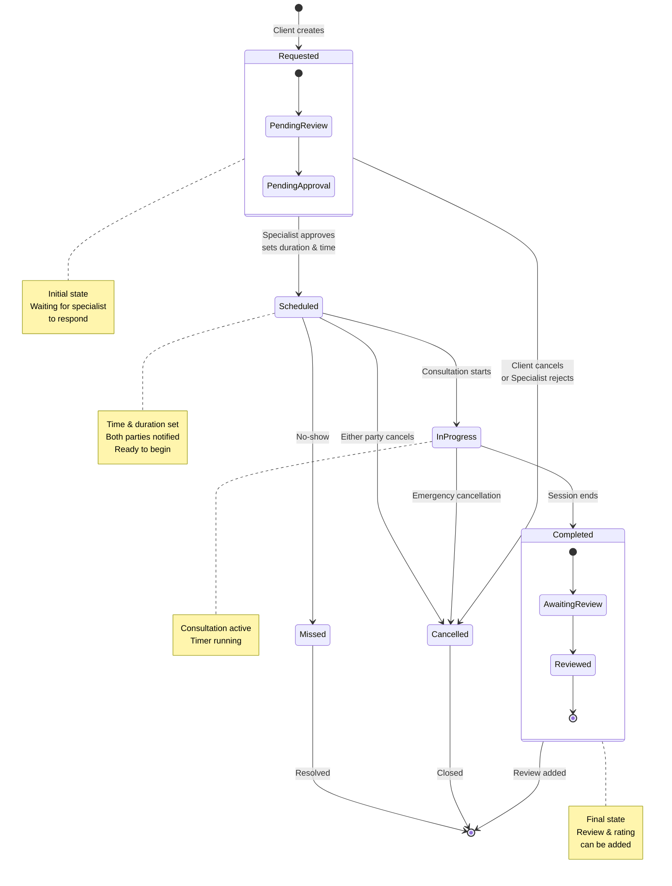

---

## 11. Flowchart - Specialist Registration Process

```mermaid
flowchart TD
    Start([Start Registration]) --> Validate[Validate Input Data]
    
    Validate --> CheckEmail{Email Already<br/>Exists?}
    CheckEmail -->|Yes| EmailError[Return "Email Already Exists" Error]
    CheckEmail -->|No| CheckLogin{Login Already<br/>Exists?}
    
    CheckLogin -->|Yes| LoginError[Return "Login Already Exists" Error]
    CheckLogin -->|No| ValidatePassword[Validate Password<br/>Strength]
    
    ValidatePassword --> PassValid{Password<br/>Valid?}
    PassValid -->|No| PassError[Return "Weak Password" Error]
    PassValid -->|Yes| CreateCreds[Create Credentials<br/>Hash Password]
    
    CreateCreds --> CreateUser[Create User Record<br/>Role = Specialist]
    CreateUser --> CreateSpec[Create Specialist Record<br/>Basic Info]
    
    CreateSpec --> CheckCategories{Has Categories?}
    CheckCategories -->|Yes| ValidateCats[Validate Category IDs<br/>Exist in DB]
    ValidateCats --> SaveRates[Save SpecialistCategoryRates<br/>Hourly Rate & Experience]
    CheckCategories -->|No| SkipRates[Skip Category Rates]
    
    SaveRates --> CheckConnections{Has Connections?}
    SkipRates --> CheckConnections
    
    CheckConnections -->|Yes| ValidateConn[Validate Connection Types<br/>WhatsApp, Viber, etc.]
    ValidateConn --> SaveConn[Save SpecialistConnections<br/>Contact Details]
    CheckConnections -->|No| SkipConn[Skip Connections]
    
    SaveConn --> SetAvailable[Set isAvailable = true<br/>Default Status]
    SkipConn --> SetAvailable
    
    SetAvailable --> SendWelcome[Send Welcome Email<br/>via NotificationService]
    SendWelcome --> ReturnSpec[Return Specialist DTO<br/>with All Relations]
    ReturnSpec --> End([End])
    
    EmailError --> End
    LoginError --> End
    PassError --> End
    
    style Start fill:#4caf50,color:#fff
    style End fill:#f44336,color:#fff
    style CheckEmail fill:#ff9800
    style CheckLogin fill:#ff9800
    style ValidatePassword fill:#ff9800
    style PassValid fill:#ff9800
    style CheckCategories fill:#ff9800
    style CheckConnections fill:#ff9800
    style ReturnSpec fill:#2196f3,color:#fff
```

---

## 12. Flowchart - Authentication & Authorization Flow

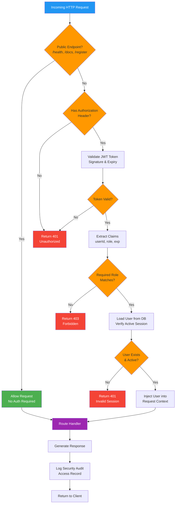

---

## 13. Deployment Diagram - Docker Compose Setup

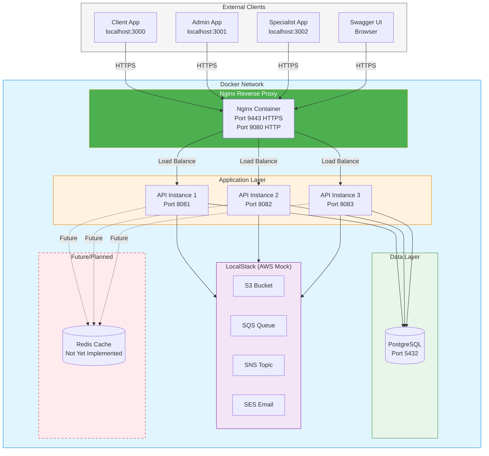

---

## 14. Component Diagram - Full System Architecture

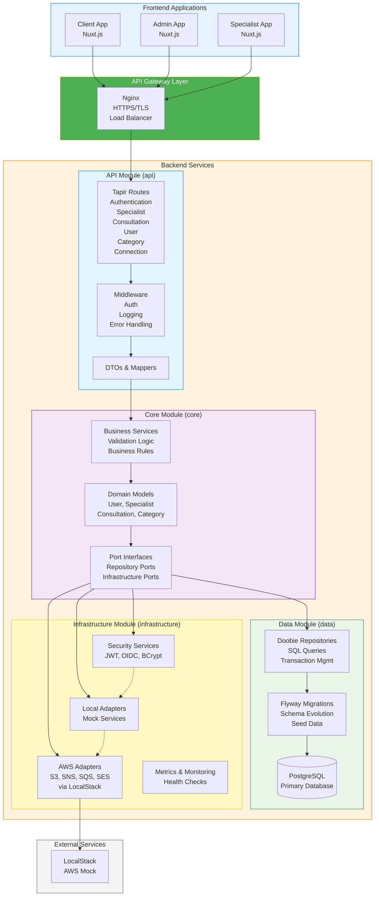

---

## 15. Package Dependency Diagram

```mermaid
flowchart LR
    subgraph Projects["SBT Subprojects"]
        API[api<br/>• HTTP Routes<br/>• DTOs<br/>• Server]
        CORE[core<br/>• Domain Models<br/>• Services<br/>• Ports]
        DATA[data<br/>• Repositories<br/>• Migrations<br/>• Doobie]
        INFRA[infrastructure<br/>• AWS Adapters<br/>• Security<br/>• Cache (stub)]
    end
    
    subgraph Libraries["Key Libraries"]
        HTTP4S[http4s<br/>Ember Server]
        TAPIR[tapir<br/>API Definitions]
        CATS[cats-effect<br/>Functional Programming]
        DOOBIE[doobie<br/>Database Access]
        CIRCE[circe<br/>JSON Handling]
        CIRIS[ciris<br/>Configuration]
        JWT[jwt-scala<br/>Token Management]
        AWS[aws-sdk<br/>AWS Services]
    end
    
    API --> CORE
    API --> DATA
    API --> INFRA
    
    DATA --> CORE
    INFRA --> CORE
    
    API --> HTTP4S & TAPIR & CIRCE
    CORE --> CATS
    DATA --> DOOBIE & CIRCE
    INFRA --> AWS & JWT & CIRIS
    
    style API fill:#e1f5fe,stroke:#0288d1
    style CORE fill:#f3e5f5,stroke:#7b1fa2
    style DATA fill:#e8f5e9,stroke:#388e3c
    style INFRA fill:#fff3e0,stroke:#f57c00
```

---

## Summary

These diagrams illustrate the complete architecture of the Consultant Backend system:

1. **Project Structure** - Shows the 4 subprojects and their dependencies
2. **Hexagonal Architecture** - Demonstrates the ports & adapters pattern
3. **Authentication Flow** - Sequence of login/token generation
4. **Search Specialists** - Query flow (no caching currently)
5. **Create Consultation** - Booking workflow with notifications
6. **Domain Models** - Core business entities and relationships
7. **Service Layer** - Business services and repository interfaces
8. **Ports & Adapters** - Implementation of hexagonal architecture
9. **ER Diagram** - Complete database schema
10. **Consultation States** - Lifecycle from request to completion
11. **Specialist Registration** - Input validation (email, login, password) and data flow
12. **Authentication Flow** - Security middleware processing
13. **Docker Deployment** - Container orchestration
14. **Component Architecture** - Full system overview
15. **Package Dependencies** - SBT project and library dependencies

**Notes:**
- **Redis**: Currently NOT implemented. `RedisCacheService` exists as a stub with noop implementations. Planned for future.
- **Notifications**: Uses `MockNotificationService` locally; AWS SES/SNS available for production.
- **Storage**: Uses `LocalStorageService` locally; AWS S3 available for production.

All diagrams follow Mermaid syntax and can be rendered in GitHub, GitLab, or any Mermaid-compatible viewer.
